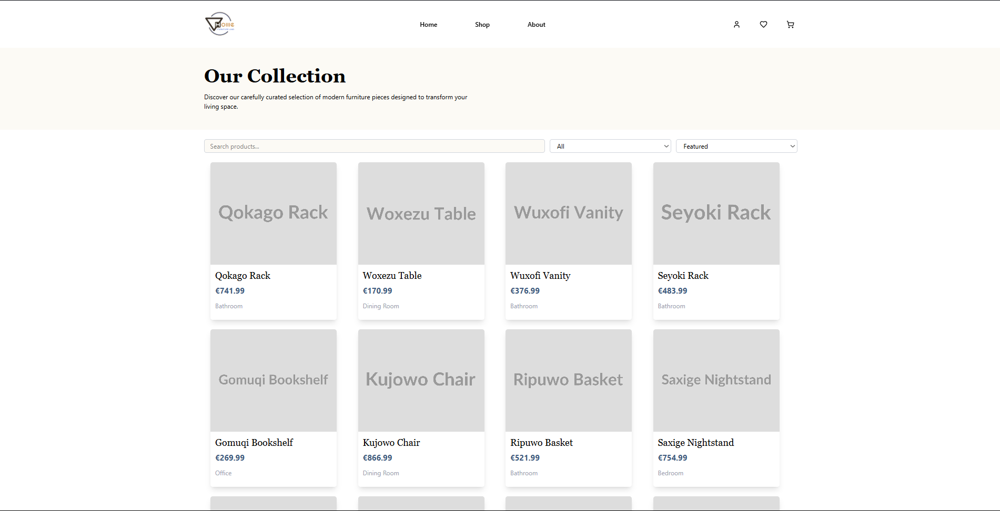
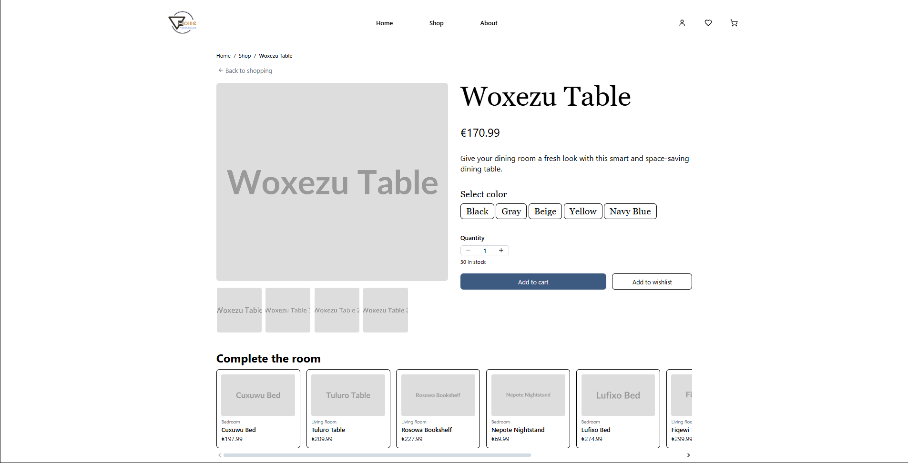
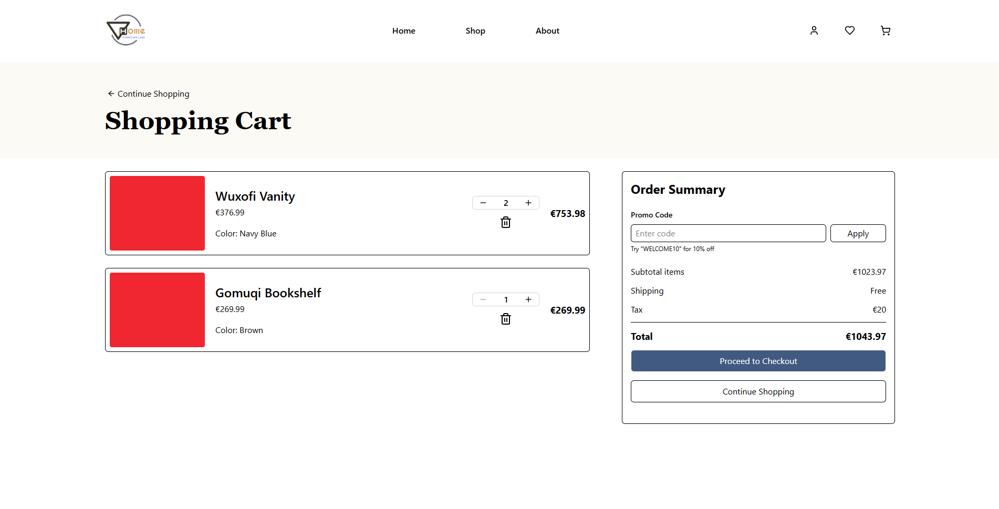
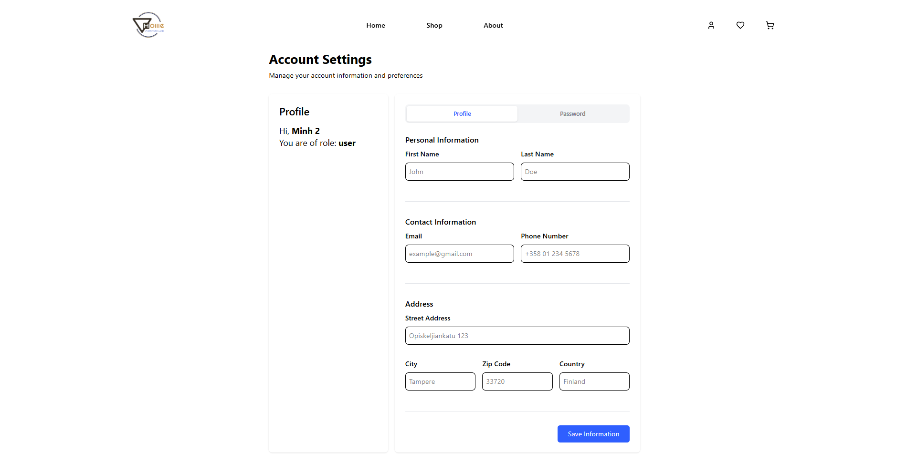
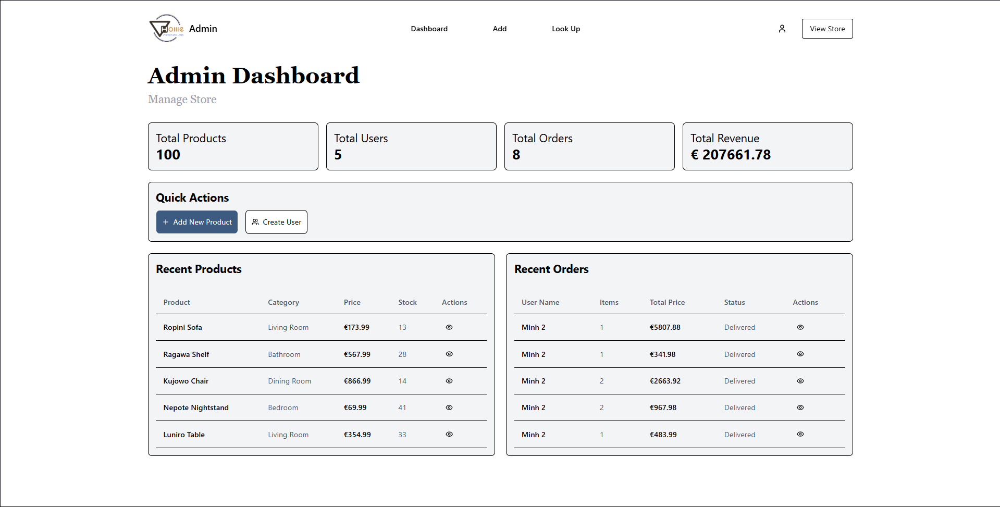
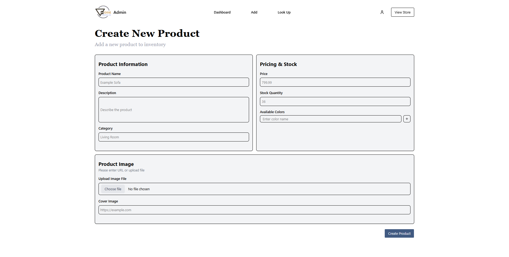
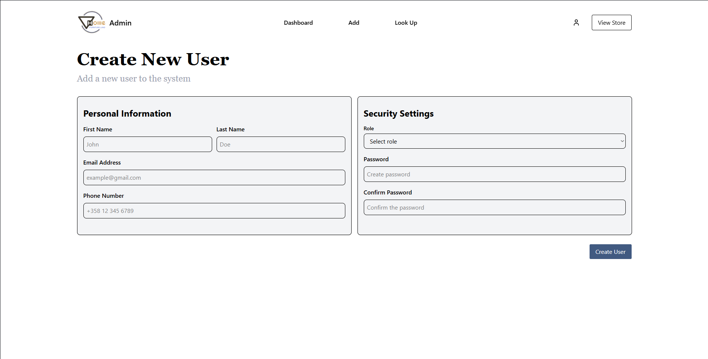
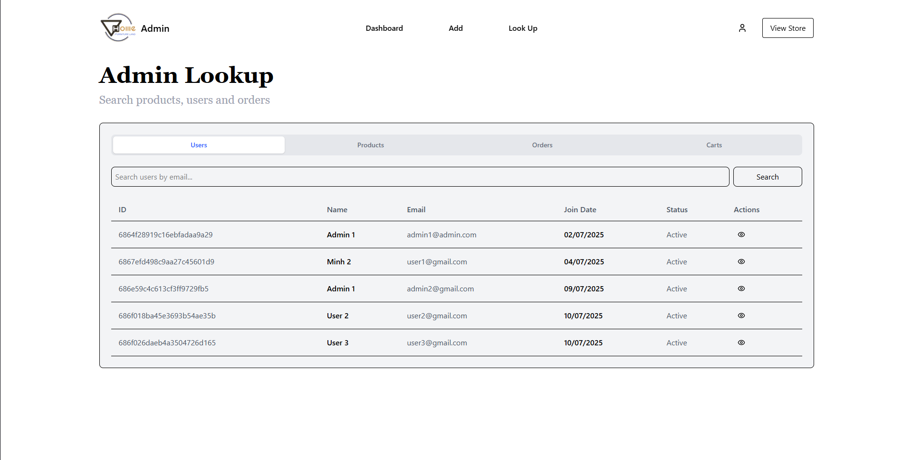

# VHome

A fullstack application built with a **Next.js (TypeScript)** frontend and an **Express.js (TypeScript)** backend for managing an E-Commerce furniture store.

---

## 📑 Table of Contents

- [Features](#features)
- [Screenshots](#screenshots)
- [Tech Stack](#tech-stack)
- [Installation and Running the App](#installation)
- [Environment Variables](#environment-variables)
- [API Documentation](#api-documentation)
- [Contact](#contact)

---

## 🚀 Features

- User authentication
- RESTful API with JWT
- Responsive UI
- Type-safe with TypeScript
- Database integration MongoDB
- Dockerization for easy deployment

### App-Specific Features

- Product catalog with categories and search functionality
- Product detail pages with images, descriptions, and reviews
- AI-powered recommendation of complimentary items based on chosen items
- Shopping cart with add, update, and remove item capabilities
- Wishlist management for saving favorite products
- Secure checkout process with Stripe payment integration
- Order history and tracking for users
- Admin dashboard for managing products, orders, and users
- Admin lookup pages for reviewing, editing and removing products, orders, carts and users
- Email notifications for order confirmations and password resets

---

## 🖼️ Screenshots
**Home Page**


**Product Catalog**


**Product Detail**


**Cart Section**


**Account Settings**


**Admin Dashboard**


**Admin Create Forms**



**Admin Lookup Section**


---

## 🛠 Tech Stack

- **Frontend:** Next.js (TypeScript)
- **Backend:** Express.js (TypeScript)
- **Database:** MongoDB
- **Other tools:** Tailwind CSS, JSON Web Token, Stripe API, NodeMailer, Axios, OpenAI API

---

## ⚙️ Installation and Running the App

### Prerequisites

- Node.js >= 18
- npm / pnpm / yarn
- **Or:** [Docker](https://www.docker.com/) (for containerized setup)

### Clone the repository

```bash
git clone https://github.com/hieuhoang018/vhome.git
```

### Using NPM

```bash
# install frontend
cd frontend
npm install
npm run dev

# install backend
cd ../backend
npm install
npm run dev
```

### Run with Docker (optional)

```bash
# from the project root
docker compose --profile dev up
or
docker compose --profile prod up
```

This will build and start both frontend and backend containers.

---

## 🔑 Environment Variables

Create `.env` files in both `frontend/` and `backend/`:

### `frontend/.env.local`

```env
NEXT_PUBLIC_API_URL=http://localhost:8080/api/v1
NEXT_PUBLIC_STRIPE_PUBLISHABLE_KEY=your_stripe_publishable_key_here
```

### `backend/.env`

```env
DATABASE = mongodb_database_url
NODE_ENV=development (or production)
PORT=8080

JWT_SECRET=your_jwt_secret_string_here
JWT_COOKIE_EXPIRES_IN=90

// Your email service options here
EMAIL_USERNAME=
EMAIL_PASSWORD=
EMAIL_HOST=
EMAIL_PORT=

STRIPE_SECRET_KEY=your_stripe_secret_key_here

FRONTEND_URL=http://localhost:3000

OPENAI_API_KEY=

```

---

## 📚 API Documentation

### Auth Routes

```
POST /api/v1/users/login : Log In
POST /api/v1/users/forgot-password : Forgot Password
POST /api/v1/users/signup : Register New Account
POST /api/v1/users/logout : Log Out
PATCH /api/v1/users/update-password : Update Password
PATCH /api/v1/users/:token : Reset Password Using Token
```

### User Routes

```
GET /api/v1/users : Get All Users
GET /api/v1/users/:id : Get Users By ID
GET /api/v1/users/me : Get Current User
POST /api/v1/users : Create New User
PATCH /api/v1/users/:id : Update User
PATCH /api/v1/users/update-information : Update Current User's Information
DEL /api/v1/users/:id : Delete User
DEL /api/v1/users/delete-account : Delete Current User
```

### Product Routes

```
GET /api/v1/products : Get All Product
GET /api/v1/products/:id : Get Product By ID
GET /api/v1/recommend/complete-room/:id : Get AI Recommended Items
POST /api/v1/products : Create New Product
PATCH /api/v1/products/:id : Update Product
DEL /api/v1/products/:id : Delete Product
```

### Review Routes

```
GET /api/v1/reviews : Get All Reviews
GET /api/v1/products/:id : Get A Product's Reviews
POST /api/v1/reviews : Post New Review
POST /api/v1/products/:id : Create Review on Product
PATCH /api/v1/reviews/:id : Update Review
DEL /api/v1/reviews/:id : Delete Review
```

### Cart Routes

```
GET /api/v1/carts : Get All Carts
GET /api/v1/carts/:id : Get Cart By ID
GET /api/v1/users/me/cart : Get Current User's Cart
POST /api/v1/users/me/cart : Add To Cart
PATCH /api/v1/users/me/cart : Update Cart Item Quantity
DEL /api/v1/users/me/cart/:id : Remove Item From Cart
```

### Orders Routes

```
GET /api/v1/orders : Get All Orders
GET /api/v1/orders/:id : Get Order By ID
GET /api/v1/users/me/order : Get Current User's Orders
POST /api/v1/orders/checkout-session : Checkout
POST /api/v1/orders : Create New Order
PATCH /api/v1/orders/:id : Update Order
DEL /api/v1/orders/:id : Delete Order
```

### Wishlist Routes

```
GET /api/v1/users/me/wishlist : Get Current User's Wishlist
POST /api/v1/users/me/wishlist : Add To Wishlist
DEL /api/v1/users/me/wishlist/:id : Remove From Wishlist
```

---

## 📬 Contact

- **Author:** Hoang Vu Hieu
- **Email:** hoangvuhieu1802@gmail.com
- **GitHub:** [@hieuhoang018](https://github.com/hieuhoang018)
